# Operationalizing Machine Learning

## Overview of project
This is the second of three projects required for the fulfilment of the Microsoft Azure Machine Learning Nanodegree program with Udacity.

This project entails configuring a cloud-base machine learning production model, deploy it, and consume it. The workflow is automated by creating and publishing a machine learning pipeline.

The project started off by registering a bank marketing dataset into azure ml studio, then, creating an automl run to train a classification model. This run generates models with mostly distinct accuracies. Only the best model is deployed as a service to be consumed through its endpoint. 

Automation is a core pillar of operationalizing machine learning; as such, this whole process was eventually automated by creating and publishing a pipeline through Python SDK. Interaction with a pipeline via an HTTP API endpoint was made possible. 

## Summary of dataset
This dataset contains data from a direct marketing campaign through phone calls of a Portuguese banking institution. The classification goal is to predict if a client will subscribe to one of the bank's product, bank term deposit, represented by the variable, y. 
	
At pristine state, the dataset contains 20 different predictor variable and 32950 rows representing different customers with 3,692 subscribing to the bank's product and 29,258 negative classes.

Click [here](https://archive.ics.uci.edu/ml/datasets/bank+marketing) for detailed information about the dataset.

Click [here](https://automlsamplenotebookdata.blob.core.windows.net/automl-sample-notebook-data/bankmarketing_train.csv) to download the dataset.

## Architectural Diagram

The project architecture as shown above consist of six major steps. 

#### Authentication
This involves creating a ``service principal`` user role account with controlled permissions to access specific resorces; hence, providing security. The Azure ML Extension would have to be installed for this to be possible. In this project, this step was skipped because the Udacity workspace was used; however, if i were to use a private Azure account, it would be necessary.

#### AutoML model
After enabling security and completing authentication, an AutoML model was trained. Register the dataset, create an experiment, and configure a compute cluster to run the experiment.

#### Deploy the best model
Deployment is about delivering a trained model into production so that it can be consumed by others. The best model from the completed automl run was deployed to interact with the HTTP API service. It was deployed into an Azure Container Instance (ACI) which offers a container technology to quickly deploy compute instances. Authentication was also enabled at this point. 

#### Enable logging
Logging is a core pillar of MLOps. It gives information on how deployed models are behaving over time. Enabling application insight helps to fulfil this purpose. Detection of anomalies, performance visualization, and log retrieval can be done using the Python SDK.

#### Consume model endpoints
Deployed models in Azure exposes HTTP endpoint that allows interaction with it. Swagger documentation and benchmarking was done. Swagger is a tool that helps build, document, and consume RESTful web services. It ensures easier and more confident interaction and explains what type of requests an API can consume: ``POST`` and ``GET``. Meanwhile, benchmark is an acceptable performance measure essential for enhancing performance and detecting anomalies.

#### Create and publish a pipeline
Automation is a core pillar of MLOps. Pipelines are a great way to automate workflows. Published pipelines allow external services to interact with them so that they can do work more efficiently.

## Key Steps
The key steps in the project are shown below with supporting images.

#### Step 1: Authentication ``Not Applicable``

#### Step 2: Creating an Automated ML experiment

*   Register the dataset in the Azure ML studio

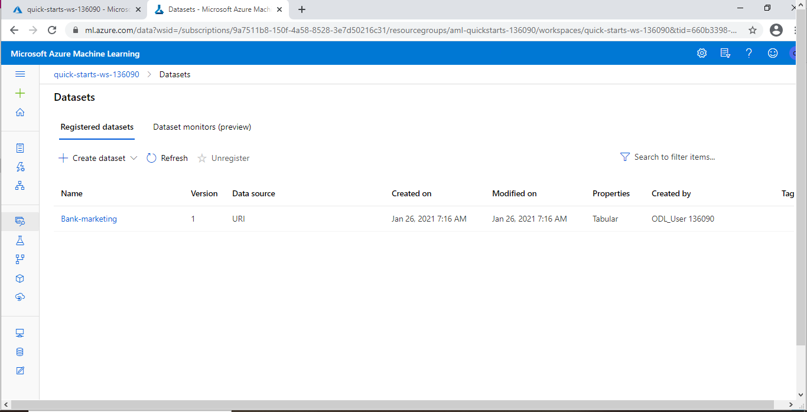
*figure 1: registered dataset in azure ml studio*

*   Create an AutoML run, configure a compute cluster with a Virtual Machine size ``Standard_DS12_v2``and  minimum number of nodes set at ``1``.

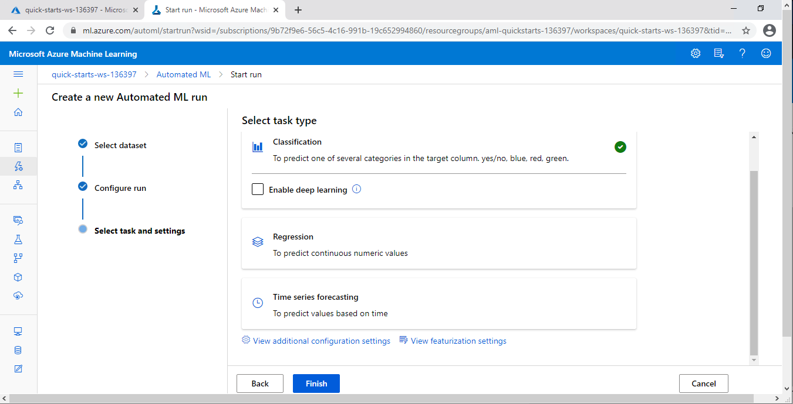
*figure 2: creating an automl run*

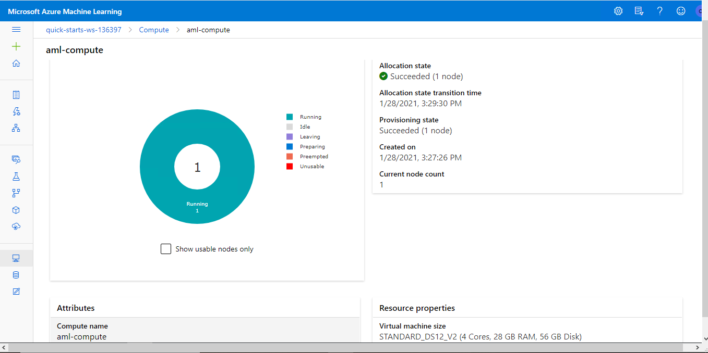
*figure 3: details of the compute cluster*

*   Run the experiment using a ``Classification`` model, ``Exit criterion`` set at ``1`` and ``Concurrency`` of ``5``. Experiment took about 23 minutes to complete.

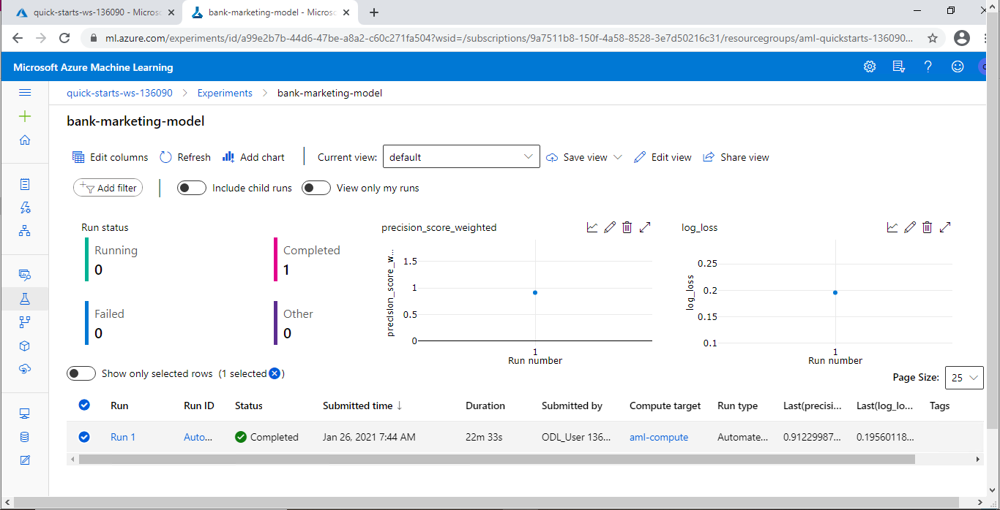
*figure 4: completed automl experiment*

*   The ``VotingEnsemble`` model was identified to be the best with ``91.87%`` accuracy.

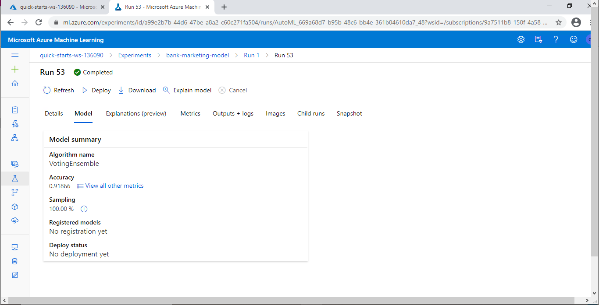
*figure 5: best model ready for deployment*

#### Step 3: Deploying the best model

The best model was deployed using an ``Azure Container Instance``. Authentication is crucial for the continuous flow of operations, as Continuous Integration and Delivery systems rely on uninterrupted flows; hence, enabling ``Authentication``.

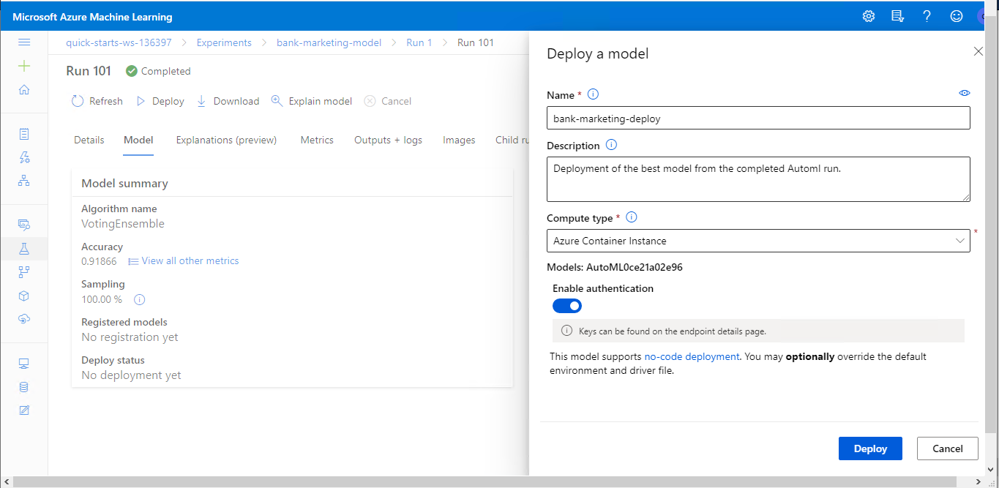
*figure 6: deployment form*

A successsfully deployed model would have its deployed status marked ``SUCCEEDED`` as seen below.

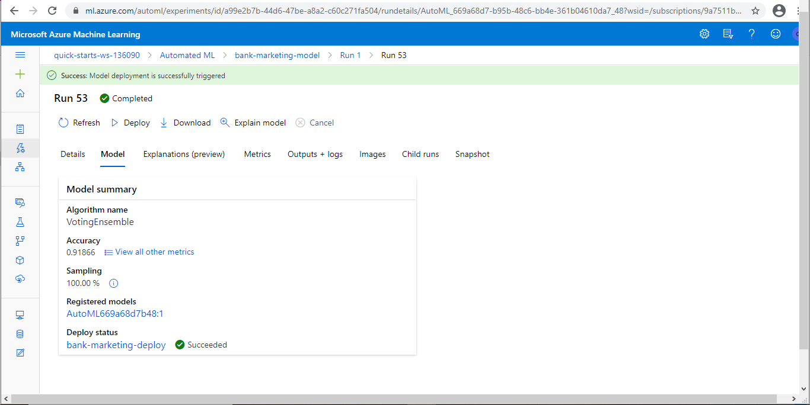
*figure 7: deployed model*

#### Step 4: Enabling Application Insights

*   Although, this could have been configured prior to deployment. However, it was done after deployment. The ``logs.py`` script was updated with the deployed model name and ``enable_app_insights`` was set to ``True`` before execution.

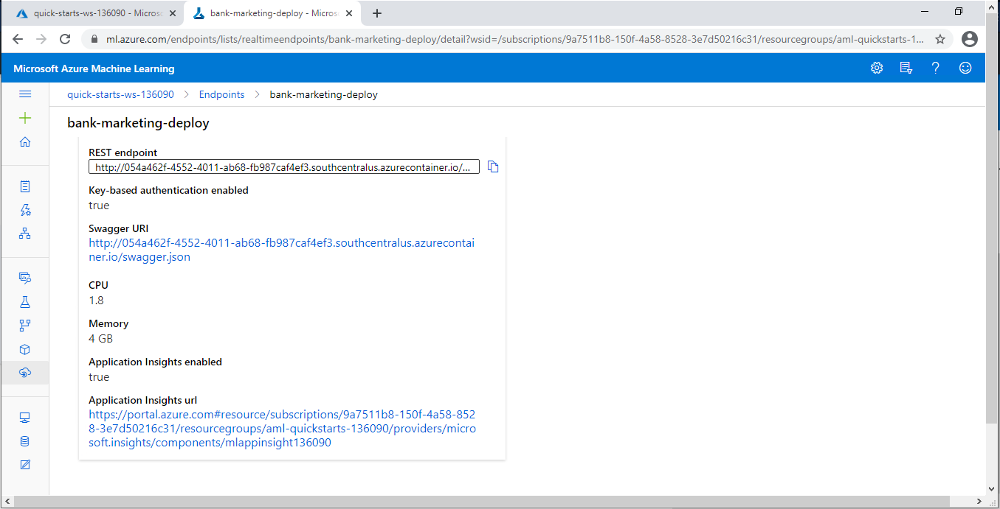
*figure 8: application insight enabled*

*   Expected return after executing the log script is shown below:

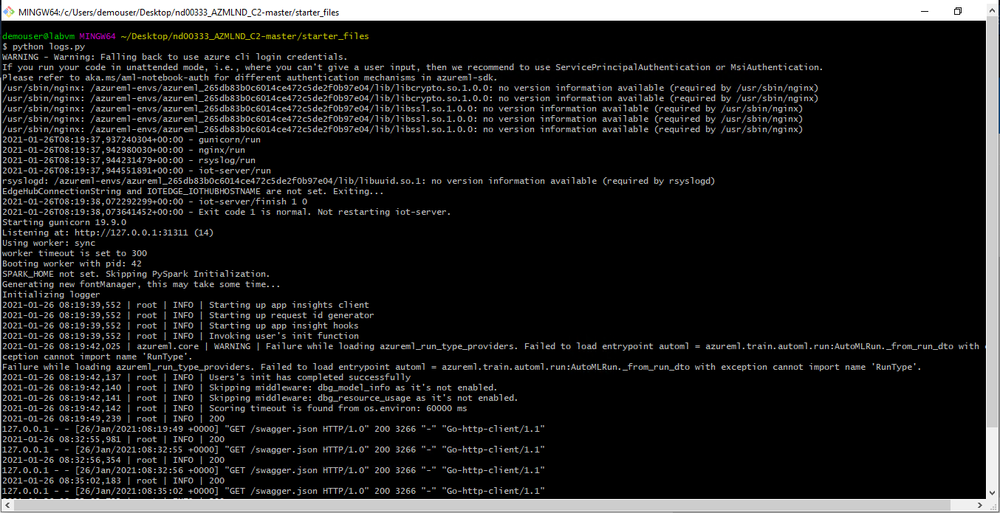
*figure 9: ``logs.py`` script execution*

*   To access the enabled application insight to analyse and visualize performance, click the ``Application Insights uri`` link. You should have something similar to this:

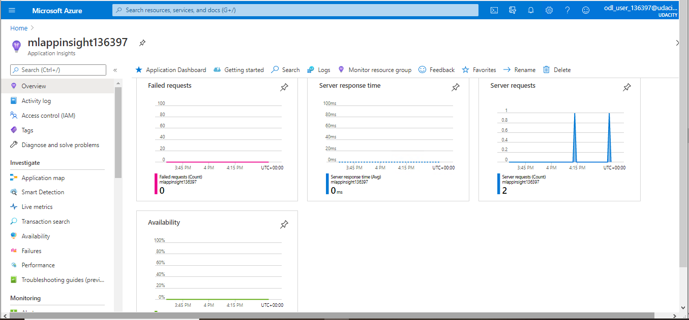
*figure 10: application insights in azure*

#### Step 5:Swagger documentation

*   A ``swagger.json`` file provided by the deployed model is downloaded and placed in the same folder with ``swagger.sh`` and ``serve.py`` scripts. 

*   Executing the ``swagger.sh`` script downloads the latest ``swagger-ui`` container to launch Swagger.

*   Executing the ``serve.py`` script protects against Cross Origin Resource Sharing (CORS) and needs to be in the same directory with ``swagger.json``.

*   Opening a browser with the used localhost server port should return a Swagger API documentation for our model.

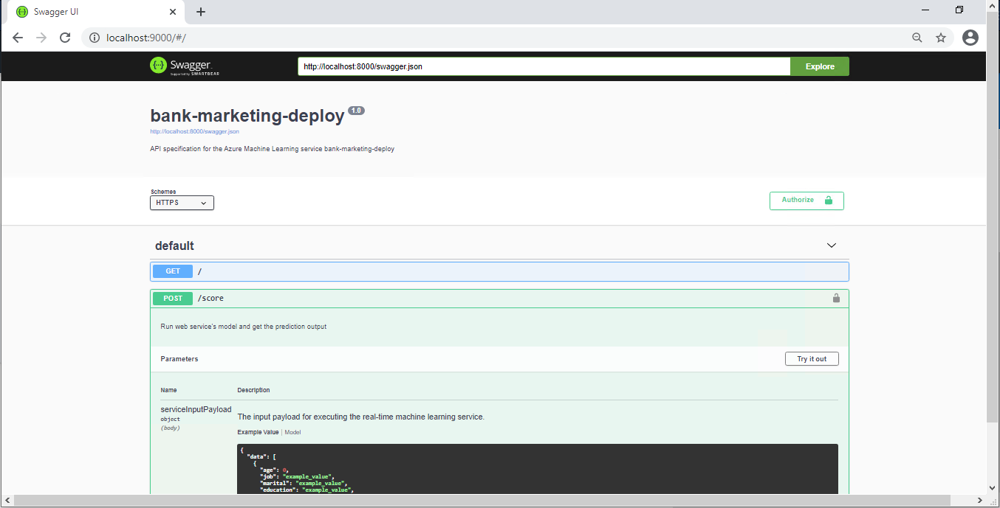
*figure 11: swagger API documentation*

#### Step 6: Consuming model endpoints and Benchmarking

*   Once the model is deployed, we can interact with the trained model using the ``endpoint.py`` script. Modified ``endpoint.py`` script contained ``scoring_uri`` and ``key`` matching the deployed model's ``RESTful API endpoint`` and ``Primary key`` respectively.

*   Execution of the script should return a json-formatted output.

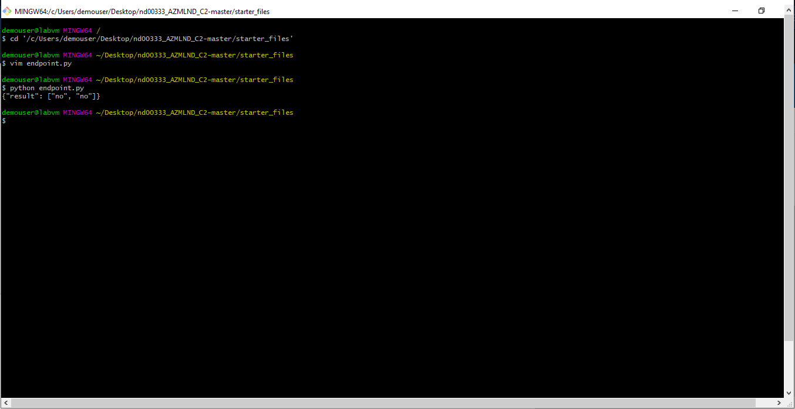
*figure 12: JSON output from the model*

*   The ``benchmark.sh`` file was also modified with the ``RESTful API endpoint`` and ``Primary key`` of the deployed model before execution.

*   Apache Benchmarking is used to benchmark the deployed model (HTTP REST API endpoint).

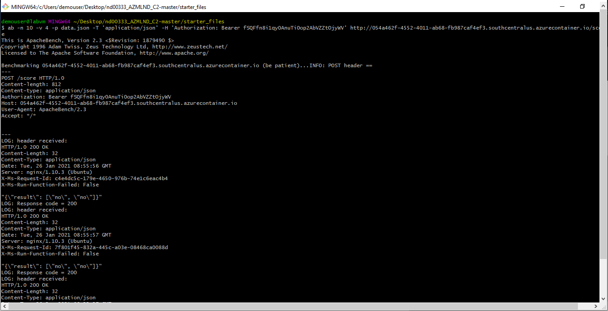
*figure 13: apache benchmark output 01*

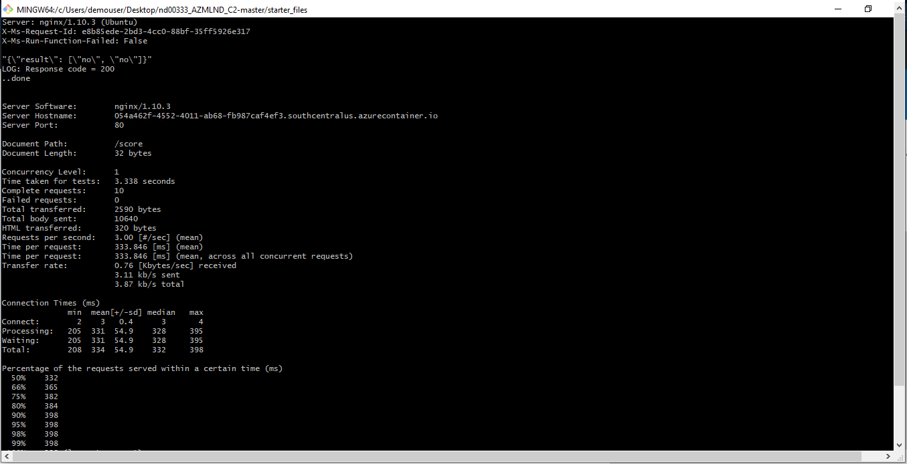
*figure 14: apache benchmark output 02*

*   The above shows that Apache Benchmarking ``ab`` runs against the HTTP API using authentication keys to retrieve performance results including number of time taken for test, failed requests, time per requests, etc.

#### Step 7: Creating and Publishing a pipeline using Python SDK

*   The Jupyter Notebook ``aml-pipelines-with-automated-machine-learning-step.ipynb`` used in creating the pipeline was uploaded to the Azure portal.

*   ``config.json`` housing the details of the workspace, subscription, and resource group was made available in the same directory with the notebook.

*   Cells were updated accordingly before running and creating the pipeline.

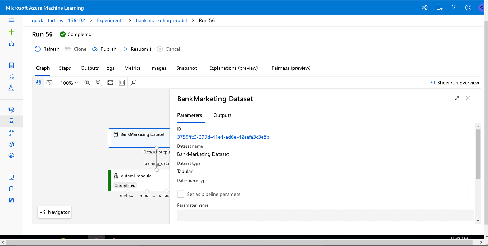
*figure 15: bank marketing dataset with the automl module*

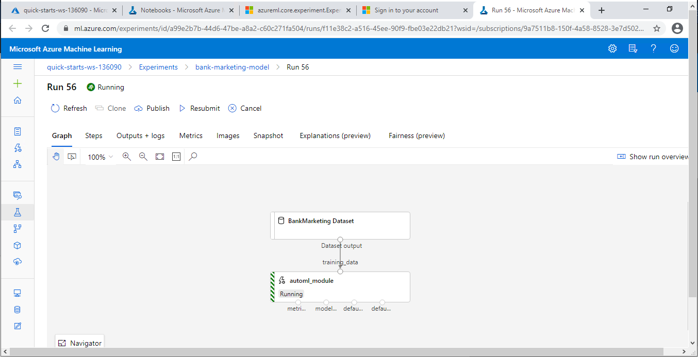
*figure 16: pipeline created*

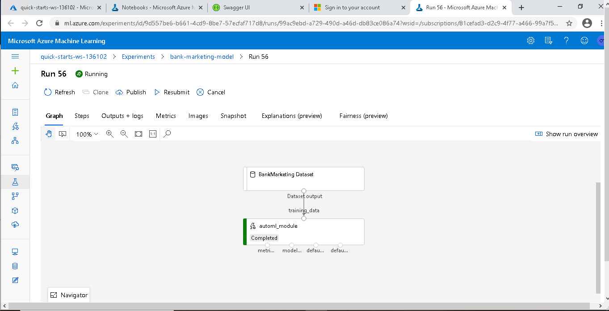
*figure 17: pipeline completed*

*   Published model exposes the REST endpoint with an ``ACTIVE`` status.

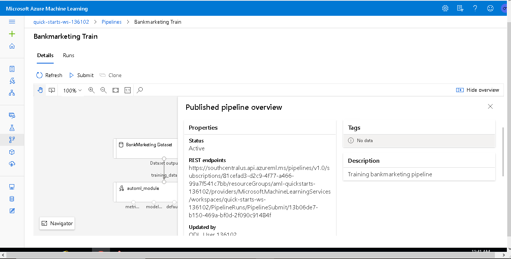
*figure 18: published pipeline overview*

*   The utmost confirmation of an existing deployed pipeline is its endpoint.

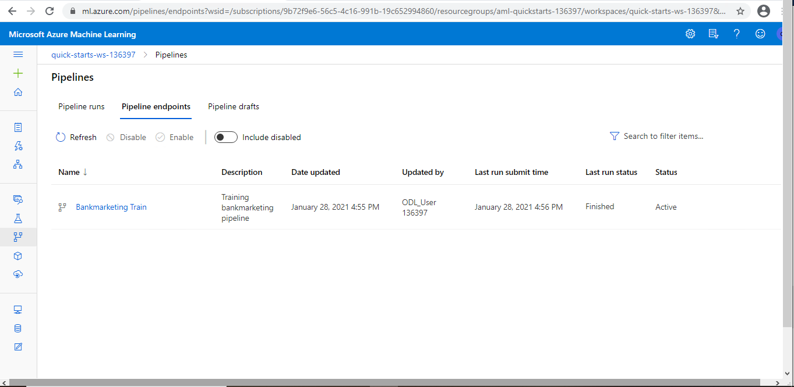
*figure 19: deployed pipeline endpoint in azure ml studio*

*   ``RunDetails`` widget in Jupyter notebook shown as completed.

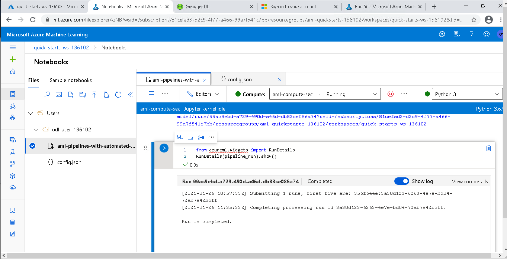
*figure 20: run details widget*

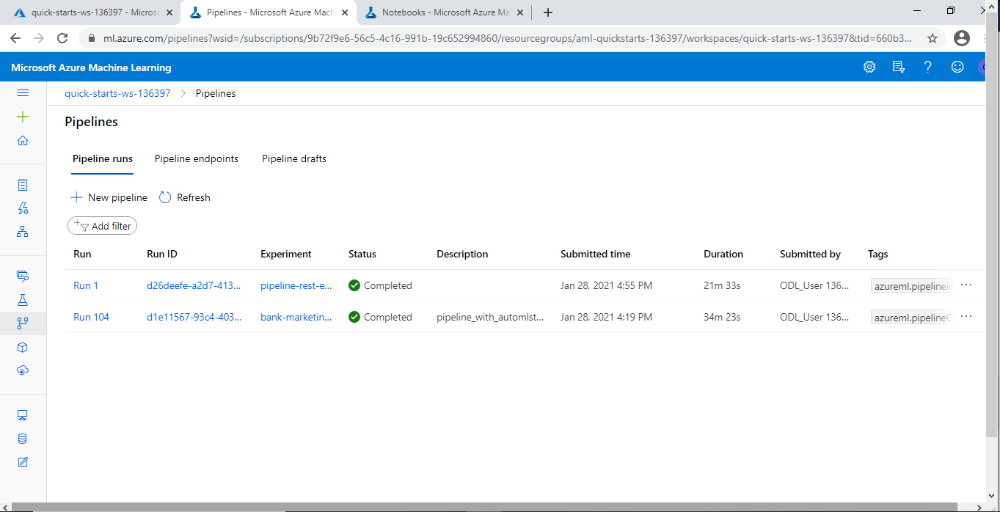
*figure 21: ml studio showing scheduled runs*

## Screen Recording

Here is a [screencast](https://www.youtube.com/watch?v=r_G3IrM05do) of this project showing key steps in the process.

## Standout Suggestions

*   Apache benchmarking tool was used to load-test the model and track its performance.
*   Authentication by the creation of a ``service principal`` user role account.
*   Creating a compute cluster, training/running an auto ml experiment, and deployment can be done using Python SDK.
*   Enabling application insights can be done before or after deployment.
*   Deployment and runtime errors can be easier to diagnose by deploying locally in a container. 

## Suggested Future Improvements for the model

*   Address class imbalance to prevent model bias.
*   Increase experiment timeout duration. This would allow for more model experimentation, but at expense of cost.
*   Try a different primary metric. Sometimes accuracy alone doesn't represent true picture of the model's performance. Recall or precision are more specific metrics in related classification problems.
*   Tweak some other AutoML confirguration parameters including number of cross validation to reduce model bias.